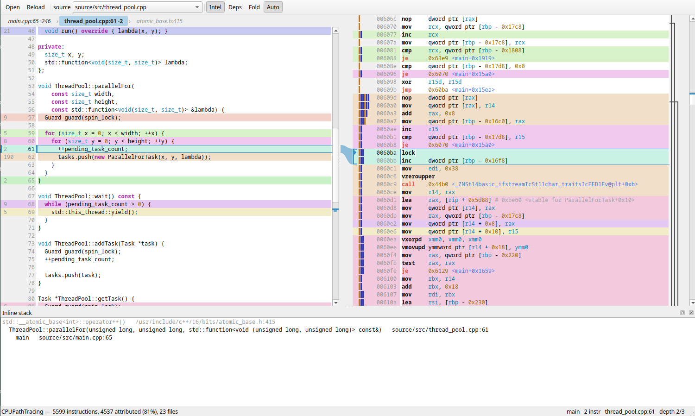

# asmview

This is a pure-slop assembly and source inspector.
Written exclusively by Claude Opus 5 with 3 total prompt messages from me.
Built to inspect the assembly of an LTO binary built by CMake.
The code I wanted to inspect was too complex for CompilerExplorer and CLion's assembly view doesn't support viewing the assembly of LTO'd translation units.

The code is roughly [`86de75d85cb7645f53028f80d4f9021a8527217a` of https://github.com/HeaoYe/CPUPathTracing/](https://github.com/HeaoYe/CPUPathTracing/commit/86de75d85cb7645f53028f80d4f9021a8527217a) compiled with
`-flto=full
-march=x86-64-v3
-fwhole-program-vtables
-fno-math-errno
-ffp-contract=fast
-fno-signed-zeros
-fno-trapping-math`

## Features

* Color-coded correspondence between the assembly and the source code
* Maps assembly to multiple files, allowing the operator to view the originator of the assembly for multiple levels in the call stack
* Detects loops and shows them in the right-hand gutter of the assembly view
* Choose whether dependencies and standard library headers are included in visualizations
* Fold assembly unrelated to the current source file to reduce noise
* A ribbon on the left side of the assembly pane indicating how many files are involved in the of the generated instruction

## Building

This project assumes CMake can find vcpkg.
There is no vcpkg setup in the project, just the manifest.
Setting `CMAKE_TOOLCHAIN_FILE` to `$VCPKG_ROOT/scripts/vcpkg.cmake` should be enough.
Alternatively, and this is what I do, you can create a `vcpkg.cmake` in some directory, point `CMAKE_TOOLCHAIN_FILE` at that file, and write `include("$ENV{VCPKG_ROOT}/scripts/vcpkg.cmake")`.
Before the `include` line, you can set various VCPKG-specific options like the target triplet.

## License

As explained in NOTICE, the copyright state of primarily AI-generated code is questionable and different across jurisdictions.
The copyrightable parts are licensed under AGPL. 
I make no claims, and give no guarantees, as to which parts of the code was and wasn't generated. 
Now or in the future.

Additionally, the code currently uses VCPKG.
On Linux, this results in statically linking Qt6 into the executable.
If you distribute the executable, you need to ensure Qt6 links dynamically.
This is a downstream condition of LGPL license of Qt.
Without changing the build otherwise, building under the `x64-linux-dynamic` vcpkg triplet should do the trick.
